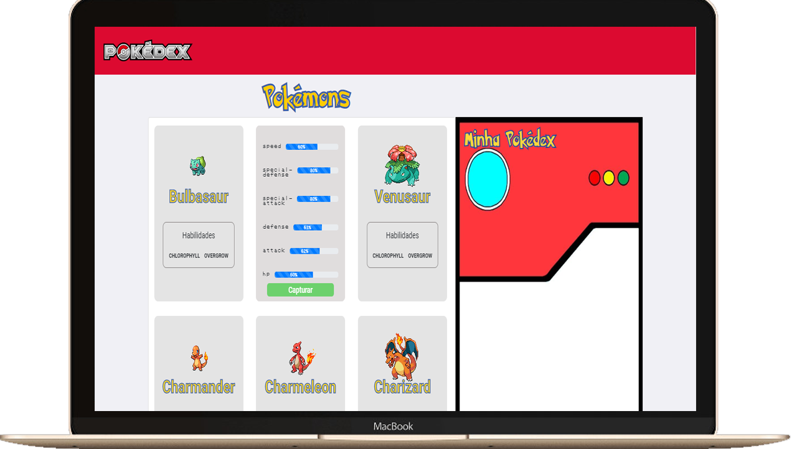
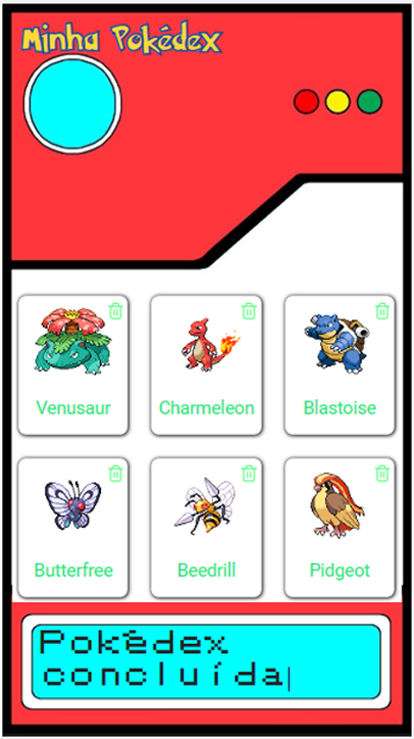

<h1 align="center">
    
</h1>

<h4 align="center">
    ❤️ Pokédex :yellow_heart:   
</h4>

  <a href="#rocket-tecnologias">Tecnologias</a>&nbsp;&nbsp;&nbsp;|&nbsp;&nbsp;&nbsp;
  <a href="#-projeto">Projeto</a>&nbsp;&nbsp;&nbsp;|&nbsp;&nbsp;&nbsp;
  <a href="#-principais-conceitos-abordados">Conceitos</a>&nbsp;&nbsp;&nbsp;|&nbsp;&nbsp;&nbsp;
  <a href="#-configuracao-do-projeto">Configurações</a>&nbsp;&nbsp;&nbsp;|&nbsp;&nbsp;&nbsp;

 

  
  

## :rocket: Tecnologias

- [React](https://reactjs.org)
- [Axios](https://www.npmjs.com/package/axios)
- [PokeAPI](https://pokeapi.co/)

## 💻 Projeto

- Aplicação de uma pokédex utilizando a PokeAPI 

## 📚 Principais conceitos abordados

- Consumir um API
- Busca pelas rotas
- State & Function

## 🤔 Configuração do projeto

- Clone o repositório
- Instale as <a href="#bookmark_tabs-possíveis-dependências-ou-frameworks">dependências</a> necessárias
- Execute 'npm start' no terminal
- Ou clique no link abaixo se deseja apenas visualizar a aplicação :smile:
  
:point_down:**Link da aplicação hospedada no Firebase** :point_down:

    

  [Pokedex](https://pokedex-1dd67.firebaseapp.com/)

*Infelizmente o Firebase tira alguns estilos como a fonte personalizada dos titles e da pokédex, assim como a diminuição da font na parte de trás dos cards dos pokémons* :cry:

**Então se deseja apreciar a aplicação em seu máximo, é recomendada a opção de clonagem do repositório**

## :bookmark_tabs: Possíveis dependências ou frameworks

- [Axios](https://www.npmjs.com/package/axios) (npm install axios / yarn add axios)
  
- [React Bootstrap](https://react-bootstrap.github.io/getting-started/introduction/) (npm install react-bootstrap bootstrap / yarn add react-bootstrap bootstrap )

